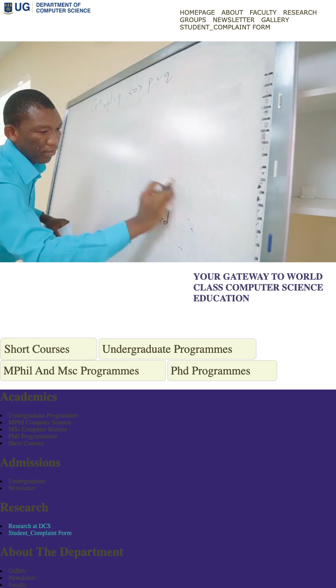
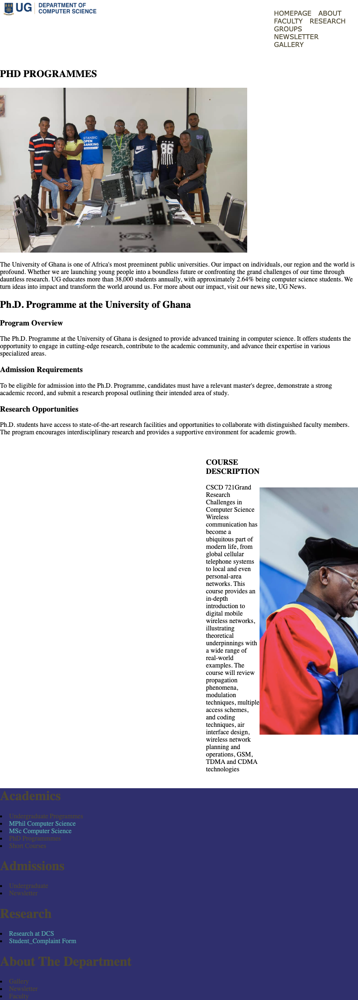

# DCIT_205_IA# 11204710_Dcit205

## Introduction
Welcome to the Department of Computer Science (DCS) homepage. DCS is a vibrant community of students, faculty, and staff, united by a shared passion for all things related to computers and computer science. We aim to provide an engaging and dynamic learning experience for our students, fostering a strong foundation in the principles and practices of computer science.

The purpose of this homepage is to provide you with an overview of the various aspects of the DCS department. Our courses span across various levels, including short courses, undergraduate programs, MPhil and MSc programs, and PhD programs. Additionally, we also cover topics like research groups and facilities. By exploring our website, you will gain a better understanding of the various opportunities and resources available to you at DCS.

## Cloning and Setup
To clone and set up the project locally, follow these steps:
1. Clone the repository using `git clone https://github.com/thejeveloper/11204710_DCIT_205.git`.
2. Navigate to the project directory: `cd my-repo-location-on-your-device`.

## Author
- Your Name: Tinkorang James
- Student ID: 11204710

## Screenshots
Here are screenshots of different pages of the website:

- 
- 
- 
- 
- 
- 
- 
- 
- 
- 

## Learnings
Throughout the creation of this webpage, I have learned the fundamentals of HTML and CSS web development. HTML, or HyperText Markup Language, is used to structure the content on the web page. CSS, or Cascading Style Sheets, is used to style the HTML elements and control the layout and appearance of the webpage.

